# ECG-ML-RPi

Portable cardiac condition diagnosis using machine learning on Raspberry Pi.

System design, validation, and performance metrics are documented in the senior thesis under `docs/`.

## Features

- **AD8232** ECG analog front-end with RC band-pass filtering (0.5–50 Hz)
- **ADS1115** 16-bit ADC sampling at 250 Hz via I2C
- **Raspberry Pi 3B+** running the full acquisition, processing, and inference pipeline
- **Digital signal processing**: zero-phase Butterworth bandpass (0.5–40 Hz), 50 Hz notch, median filter
- **QRS detection & PQRST delineation** using SciPy peak-finding
- **54 temporal and morphological features** extracted per heartbeat window
- **Random Forest classifier** (98.75% test accuracy) — 4 classes: NSR, ARR, CHF, AFF
- **Flutter mobile app** for wireless control, live waveform viewing, and diagnosis display
- **RESTful Flask server** (Waitress, 4 threads) exposing `/record`, `/extract`, `/diagnose`, `/download`

## System Architecture

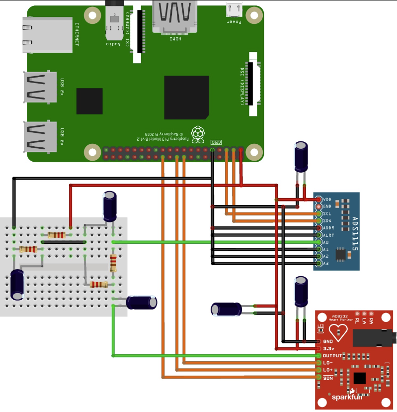

*AD8232 → RC filter → ADS1115 ADC → Raspberry Pi → Flutter app*

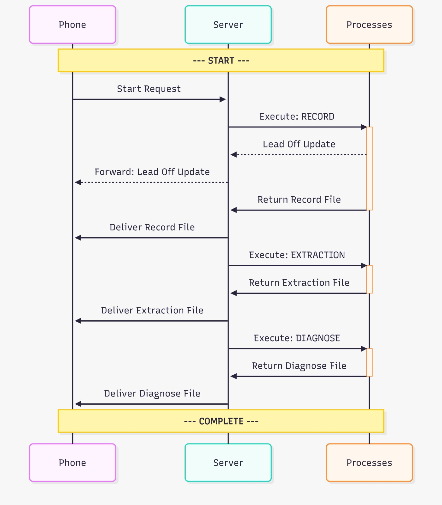

*Server workflow: recording → feature extraction → ML inference → diagnosis*

## Repository Structure

```
ECG-ML-RPi/
├── src/
│   ├── server.py          # Flask REST API (orchestrates pipeline)
│   ├── record_IOO_n.py    # IIO ADC reader / recorder (argparse)
│   ├── extract.py         # Digital filtering + feature extraction
│   ├── classify.py        # Random Forest inference (argparse)
│   ├── Models/            # Pre-trained .pkl (scaler, selector, forest)
│   └── Recordings/        # Sample CSV recordings
├── data/                  # Additional recordings & datasets
├── prototyping/           # Experimental scripts (extraction, training, data reader)
├── docs/
│   └── figures/           # System diagrams, schematics, screenshots
├── models/                # (empty — models live in src/Models/)
└── .gitignore
```

## Signal Processing Pipeline

### Stage 1 — Raw Acquisition

Raw 250 Hz samples from ADS1115 with baseline wander, power-line interference (50 Hz), and muscle artifacts.

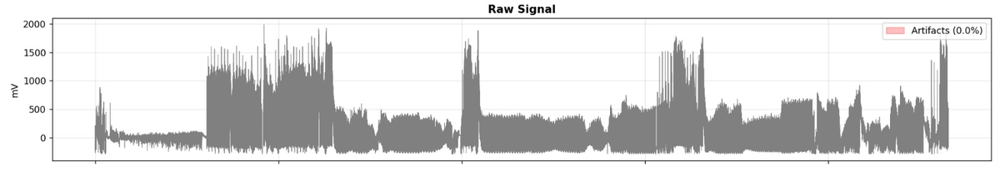

### Stage 2 — Digital Bandpass + Notch

Zero-phase Butterworth filter (0.5–40 Hz) + 50 Hz notch removes out-of-band noise and mains hum.

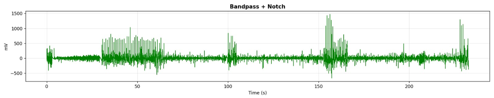

### Stage 3 — Median Filter

3-sample median filter removes short spikes and outliers.

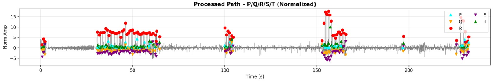

### Stage 4 — PQRST Delineation

R peaks detected via SciPy `find_peaks`; P, Q, S, T located in windows relative to R.

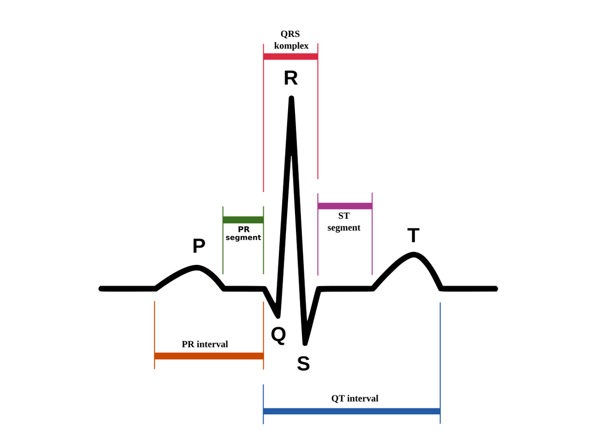

## Hardware Design

### Analog Front-End

The AD8232 single-lead ECG amplifier feeds into a discrete RC filter network providing band-pass conditioning (~0.5–50 Hz) before digitization.

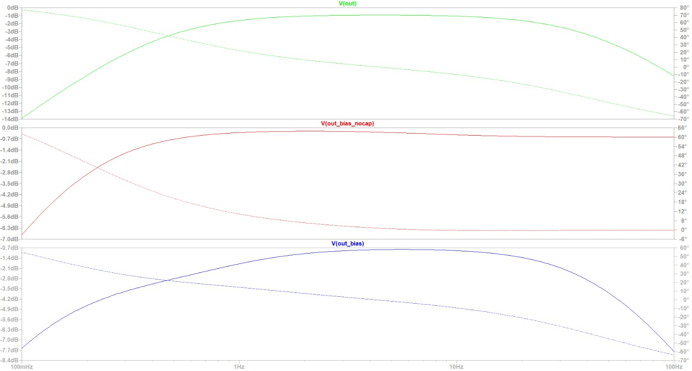

### PCB Evolution

| Revision | Description |
|----------|-------------|
| Breadboard | Initial prototype — high noise, fragile wiring |
| Single-layer PCB | Toner-transfer etched — reduced noise |
| Double-layer PCB | Fabricated — continuous ground plane, direct header mount, best noise performance |

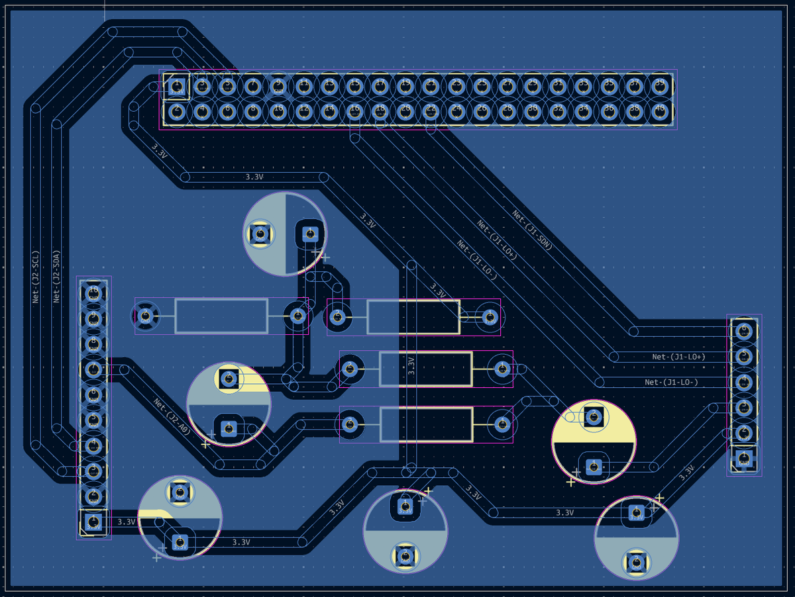

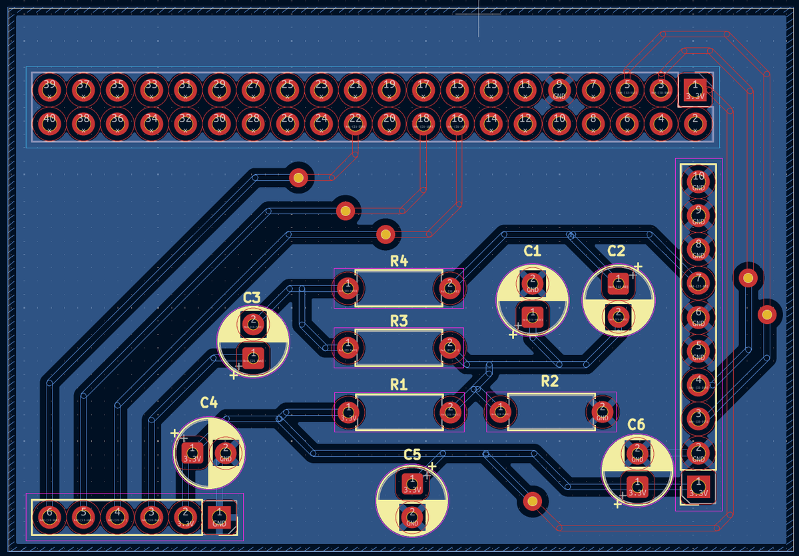

## Machine Learning Model

**Classifier**: Random Forest (100 trees, max depth 20, min samples per leaf 5)
**Preprocessing**: Standardization → feature selection (top 30 by importance)
**Dataset**: ECG of Cardiac Ailments (Kaggle) — 1200 samples, balanced across 4 classes

### Performance on Held-Out Test Set

| Class | Precision | Recall | F1-Score | Support |
|-------|-----------|--------|----------|---------|
| AFF | 0.98 | 0.98 | 0.98 | 51 |
| ARR | 0.98 | 1.00 | 0.99 | 56 |
| CHF | 0.98 | 0.97 | 0.98 | 66 |
| NSR | 1.00 | 1.00 | 1.00 | 67 |

**Test accuracy**: 98.75%
**Train-test gap**: 1.25%

Diagnosis is reported only when confidence ≥ 50%. Predictions near ~25% per class are flagged as uncertain.

## Flutter Mobile Application

Cross-platform Flutter app (iOS/Android) connects to the Pi over WiFi for controlling recordings, monitoring electrode connectivity, viewing waveforms, and displaying diagnosis results.

<p float="left">
  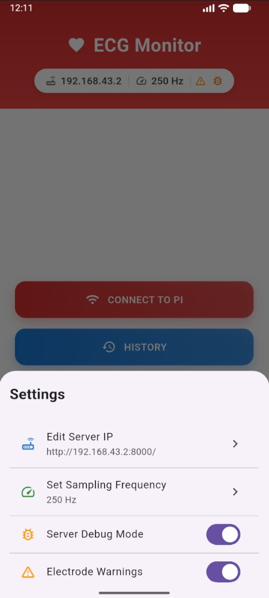
  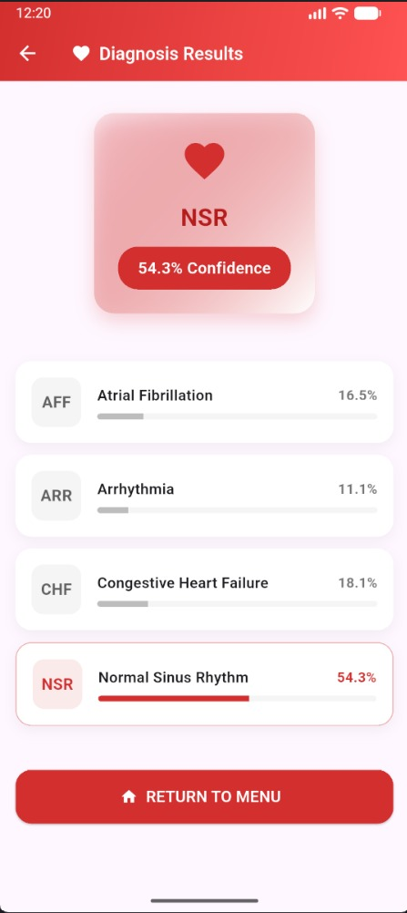
</p>

## References

- Pan & Tompkins (1985) — Real-time QRS detection algorithm
- Breiman (2001) — Random Forests
- Akki2703 — ECG of Cardiac Ailments Dataset (Kaggle)
- Full thesis: `docs/` contains the complete design report
