# ECG-ML-RPi

Portable cardiac condition diagnosis using machine learning on Raspberry Pi.

System design, validation, and performance metrics are documented in the senior thesis available under `docs/`.

## Features

- **AD8232** ECG analog front-end with RC band-pass filtering (0.5–50 Hz)
- **ADS1115** 16-bit ADC sampling at 250 Hz via I2C
- **Raspberry Pi 3B+** running the full acquisition, processing, and inference pipeline
- **Digital signal processing**: zero-phase Butterworth bandpass (0.5–40 Hz), 50 Hz notch, median filter
- **QRS detection & PQRST delineation** using SciPy peak-finding
- **54 temporal and morphological features** extracted per heartbeat window
- **Random Forest classifier** (98.75% test accuracy) — 4 classes: NSR, ARR, CHF, AFF
- **Flutter mobile app** for wireless control, live waveform viewing, and diagnosis display
- **RESTful Flask server** (Waitress, 4 threads) exposing `/record`, `/extract`, `/diagnose`, `/download`

## System Architecture


*AD8232 → RC filter → ADS1115 ADC → Raspberry Pi → Flutter app*


*Server workflow: recording → feature extraction → ML inference → diagnosis*

## Repository Structure

```
ECG-ML-RPi/
├── src/
│   ├── server.py          # Flask REST API (orchestrates pipeline)
│   ├── record_IOO_n.py    # IIO ADC reader / recorder (argparse)
│   ├── extract.py         # Digital filtering + 54-feature extraction
│   ├── classify.py        # Random Forest inference (argparse)
│   ├── Models/            # Pre-trained .pkl (scaler, selector, forest)
│   └── Recordings/        # Sample CSV recordings
├── data/                  # Additional recordings & datasets
├── prototyping/           # Experimental scripts (extraction, training, data reader)
├── docs/
│   └── figures/           # System diagrams, schematics, screenshots
├── models/                # (empty — models live in src/Models/)
└── .gitignore
```

## Hardware Design

### Analog Front-End

The AD8232 single-lead ECG amplifier feeds into a discrete RC filter network providing band-pass conditioning (~0.5–50 Hz) before digitization.

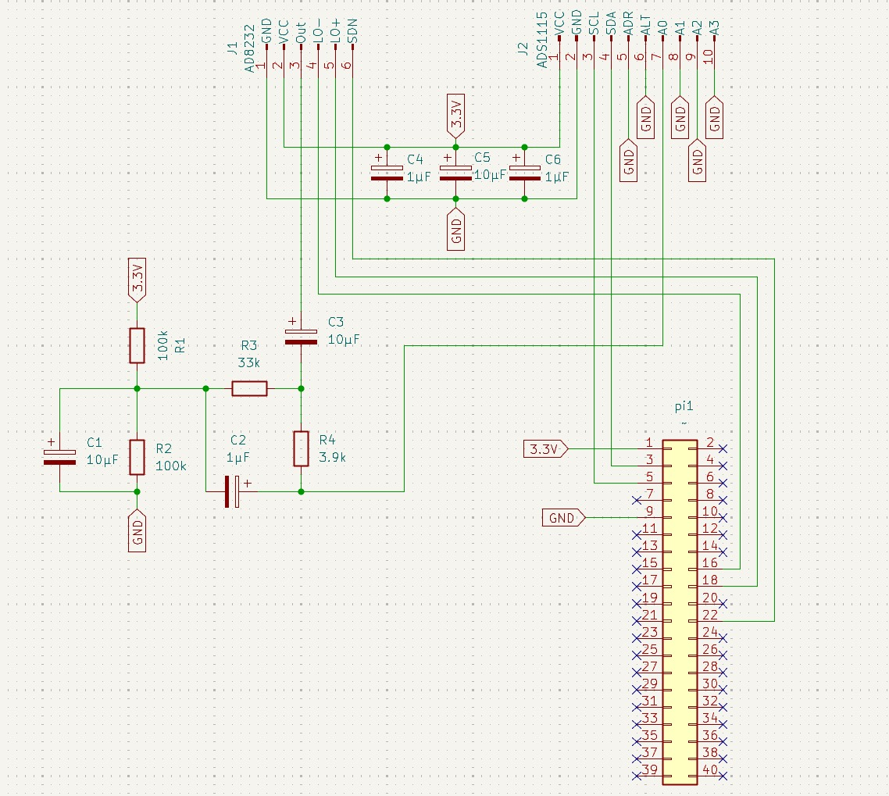

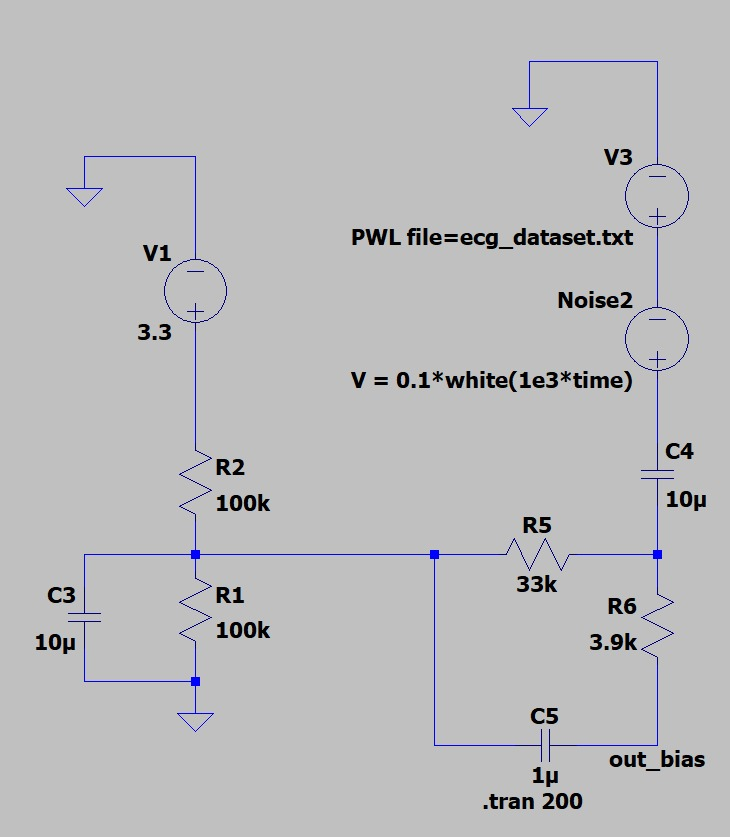


### PCB Evolution

| Revision | Description |
|----------|-------------|
| Breadboard | Initial prototype — high noise, fragile wiring |
| Single-layer PCB | Toner-transfer etched — reduced noise, wired connection to Pi |
| Double-layer PCB | Fabricated — continuous ground plane, direct header mount, best noise performance |


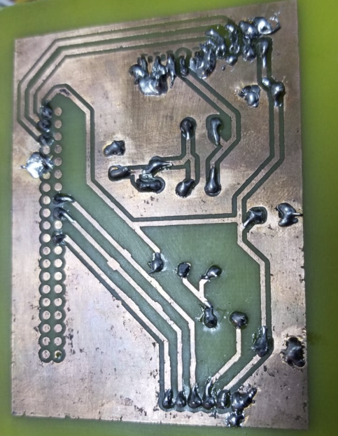


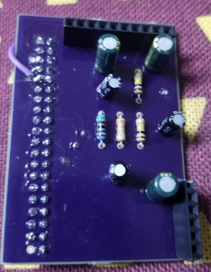

### Bill of Materials

| Component | Value/Model | Purpose |
|-----------|-------------|---------|
| IC1 | AD8232 | Single-lead ECG amplifier |
| IC2 | ADS1115 | 16-bit I2C ADC |
| R1, R2 | 100 kΩ | High-pass filter |
| R3 | 33 kΩ | Low-pass filter |
| R4 | 3.9 kΩ | Low-pass filter |
| C1 | 10 µF | High-pass coupling |
| C2/C4/C6 | 1 µF | Bypass / decoupling |
| C3/C5 | 10 µF | Low-pass / bulk decoupling |
| Controller | Raspberry Pi 3B+ | Processing, WiFi, GPIO |

## Signal Processing Pipeline

### Stage 1 — Raw Acquisition

Raw 250 Hz samples from ADS1115, subject to baseline wander, power-line interference (50 Hz), and muscle artifacts.


### Stage 2 — Digital Bandpass + Notch

Zero-phase Butterworth filter (0.5–40 Hz) + 50 Hz notch removes out-of-band noise and mains hum.


### Stage 3 — Median Filter

3-sample median filter removes short spikes and outliers while preserving waveform morphology.


### Stage 4 — PQRST Delineation

R peaks detected via SciPy `find_peaks`; P, Q, S, T located in windows relative to R.

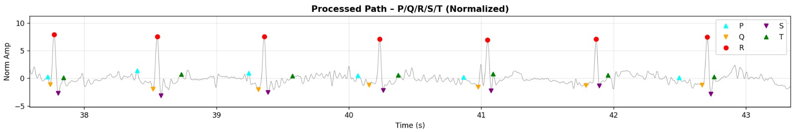

### Feature Extraction

54-dimensional feature vector per window:

- **Temporal intervals**: Pseg, PQseg, QRSseg, QTseg
- **Morphological**: distances, areas, angles, slopes between wave landmarks
- **HRV metrics**: SDRR, RMSSD, pNN50


### Long-Duration Robustness

Electrode contact inconsistencies are handled via lead-off detection (GPIO) and selective windowing of clean signal segments.

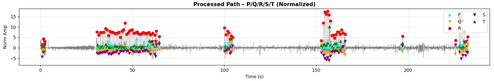

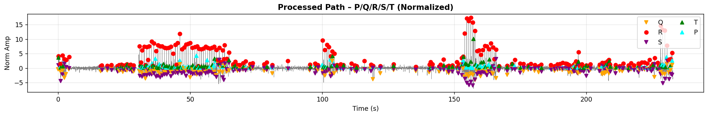

## Machine Learning Model

**Classifier**: Random Forest (100 trees, max depth 20, min samples per leaf 5)
**Preprocessing**: Standardization → feature selection (top 30 by importance)
**Dataset**: ECG of Cardiac Ailments (Kaggle) — 1200 samples, balanced across 4 classes

### Performance on Held-Out Test Set

| Class | Precision | Recall | F1-Score | Support |
|-------|-----------|--------|----------|---------|
| AFF | 0.98 | 0.98 | 0.98 | 51 |
| ARR | 0.98 | 1.00 | 0.99 | 56 |
| CHF | 0.98 | 0.97 | 0.98 | 66 |
| NSR | 1.00 | 1.00 | 1.00 | 67 |

**Test accuracy**: 98.75%
**Train-test gap**: 1.25% (no significant overfitting)

### Usage

```bash
# Classify a feature CSV
python src/classify.py --input features.csv --output diagnosis.txt
```

Diagnosis is reported only when confidence ≥ 50%. Predictions near ~25% per class are flagged as uncertain.

### Electrode Contact Robustness

A threshold slider was implemented during development to optimize detection parameters per recording condition.

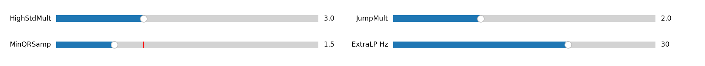

## Flutter Mobile Application

The cross-platform Flutter app (iOS/Android) connects to the Pi over WiFi and provides:

- Server connection management (IP address, status)
- Recording initiation with electrode power control (SDN pin)
- Live lead-off / connectivity monitoring
- Waveform visualization
- Debug mode (skip recording, use prerecorded data)
- Diagnosis display with per-class confidence

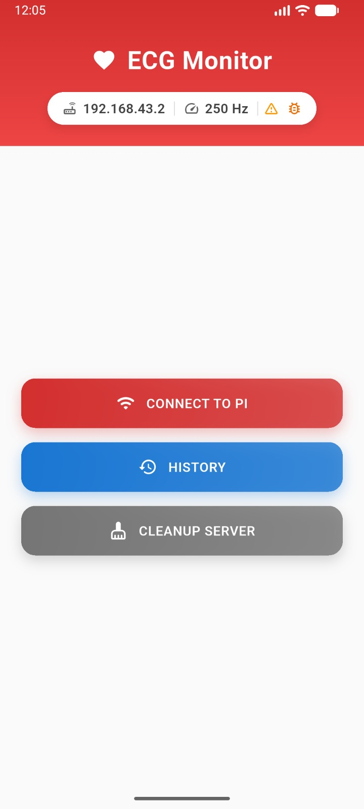

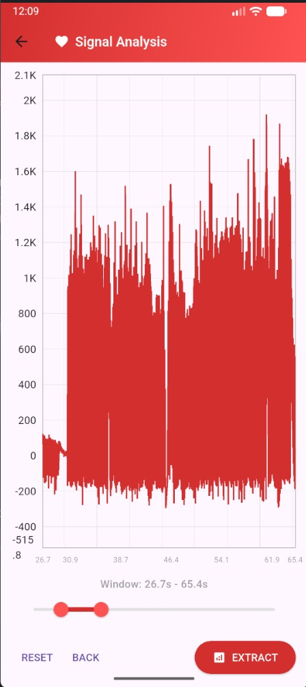
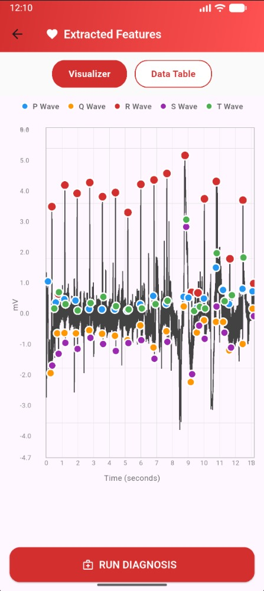


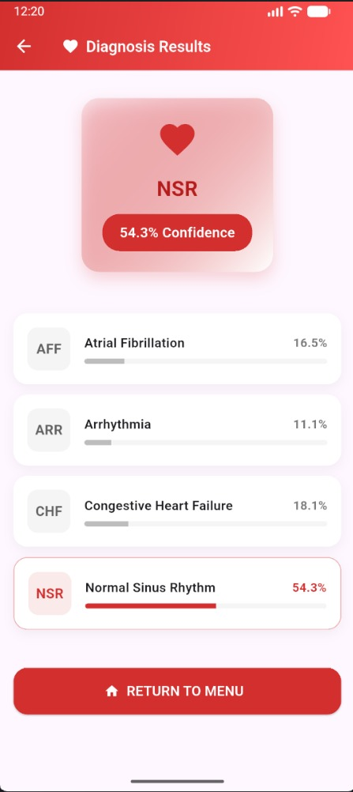

## Usage

### On the Raspberry Pi

```bash
# Start the server
python src/server.py

# Or run pipeline steps individually:
python src/record_IOO_n.py --duration 30           # Record 30 seconds
python src/extract.py --input recording.csv         # Extract features
python src/classify.py --input features.csv         # Run diagnosis
```

### API Endpoints

| Route | Method | Description |
|-------|--------|-------------|
| `/record` | POST | Start ECG recording |
| `/extract` | POST | Extract features from raw signal |
| `/diagnose` | POST | Run ML inference, return diagnosis with confidence |
| `/download` | GET | Download CSV with signal + features + diagnosis |

## References

- Pan & Tompkins (1985) — Real-time QRS detection algorithm
- Breiman (2001) — Random Forests
- Akki2703 — ECG of Cardiac Ailments Dataset (Kaggle)
- Full thesis: `docs/` contains the complete design report

## Authors

Muntasir Mohammad Ahmad, Malak Ehab Hassaan — ECNG 4981, Fall 2025
Supervised by Dr. Hassanein Amer — AUC
